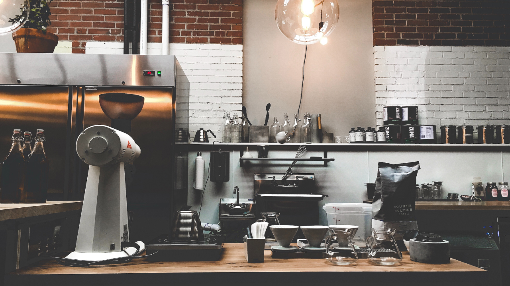
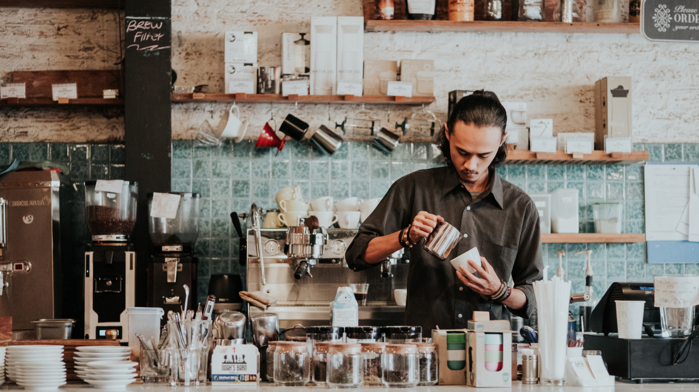

## 너는 카페 가면 뭐 봐?

넌 커피회사 다니니까.

커피회사 마케터로 일하며 자주 받았던 질문 중에 하나.

지금의 카페와 커피를 소비하는 방법.  아름답고 유니크한 공간 자체를 소비하고, 미식으로서 커피를 소비하기까지 과연 몇 년이나 걸렸을까? 폭발적 성장이라는 말도 식상한 속도. 이렇게나 빨리 한국 커피 문화가 성숙하면서 소비자 스탠더드도 같이 높아졌으니 정말 신나는 일이다.

벌써 한국 커피 씬은 실제 글로벌리 top급이다. 초기 스페셜티 플레이어들의 성장과 선도가 많은 기여를 했을 거라 생각한다.

그들이 어떤 생각으로 브랜드, 공간을 만드는지에 대한 이야기이기도 하고 "요즘은 어느 카페가 핫해? 넌 카페 가면 뭐 봐?" 에 대한 답이기도 한 이야기를 썰 풀듯 적어본다.

**<u>커피회사 마케터에게만 보이는 것들</u>**

오프라인에서의 UX, 브랜드 경험설계는 정말이지 노동집약적이다. 공간이란 건 웹이나 앱처럼의 수정이 어려우니까. 잘못된 판단임이 드러나고 수정해야 할 부분이 뻔히 보이는데도 즉시 고쳐나가는 게 어렵다는 소리다. 보기엔 접근이 쉬워보인다는 것도 재밌는 부분이고.

공간기반임에도 최대한 린Lean하게 접근하는 조직에서 했던 다양한 경험들을 관찰자 시점에서 공간/사람/콘텐츠의 구분으로 나눠서 하나씩 풀어보려고 한다.

생각 없이 카페를 즐기기 어려웠지만, 그래서 남들보다 더 재밌게 즐겼던 것들.  손님이 보는 것들과 교집합인 것들도 많고 공급자로서 궁금해서 보이는 것들도 있고.

커피집이면 커피만 잘하면 되는 거 아닌가? 아니, 커피는 당연히 잘해야 하는 거고.

**<u>먼저, 공간에 대해.</u>**

바리스타가 일하는 동선은 어떠한지,손님인 내게 어떤 동선을 유도한 건지. 말하자면 UX설계. 바리스타의 동선을 얼마나 배려했는지.

나는 직업인의 작업환경, 공간에 배려가 녹은 게 보일 때 사람 냄새를 많이 느끼고, 즐거운 일터라고 느껴지는 브랜드나 회사에 더 마음이 간다.

****

바리스타가 일하기 편한 구조인지. 바의 높이나 폭. 수납공간. 음료 제조할 때의 동선 같은 것.  원두 담아 탬핑하고 추출하고 얼음 푸고 컵에 담아 픽업대에 내놓기까지. 이 가운데 얼마나 오너가 바리스타(오너=바리스타인 곳 있지만)의 작업환경에 신경을 썼는지를 보게 된다.

****

예를 들어 싱크대의 적절한 위치라던지, 매번 체중을 실어 탬핑할 때 무리가지 않을만한 테이블의 높이라던지. 얼음 소비 많은 매장이라면 제빙기에서 얼음을 매번 푸는 것보다 허리에 무리가 덜 가는 아이스빈이 설치되어있는지 등. 머신이나 식재료들 배치, 수납도 '보기 좋음'과 '일하기 좋음'의 사이에 잘 조율된 바의 UX를 보면 마음이 편안-해진다.  기능이나 사람은 무시된 채 멋짐만 추구한 공간, 특히 바BAR를 볼 때면 "에이 너무하네, 일하기 힘들겠다. 힘들면 손님 눈에 다 보이는데"하는 생각으로 이어지고.  

****

따져보면 다 비용이고 중요도와 우선순위의 견해차겠지만 적어도 일하기 좋은 환경에서 더 맛있는 커피 한잔이 나온다고 믿는다.

그다음이 인테리어 측면에서  공간 구획, 가구나 조도, 여백과 텍스쳐,  콘센트 그리고 좌석 수, 화장실과 향 같은 것 들을 보게 된다.

좋다 나쁘다는 없고 '답게' 한 것. 일관성 있는 컨셉과 날 선 디테일이 보일 때 멋진 것 같다.

친해지고 싶은 사람의 취향을 하나하나 파악하듯이 '나라서 발견했다'라는 즐거움을 주는 디테일이 있을 때 무릎을 탁 치게 되는 것이지.

   
