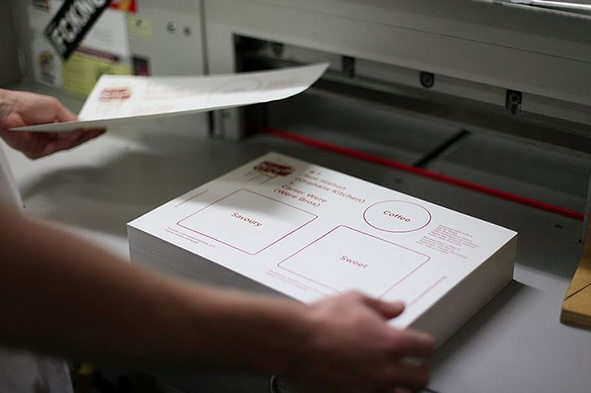
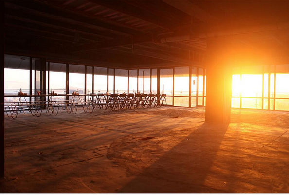
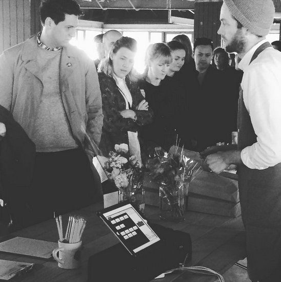
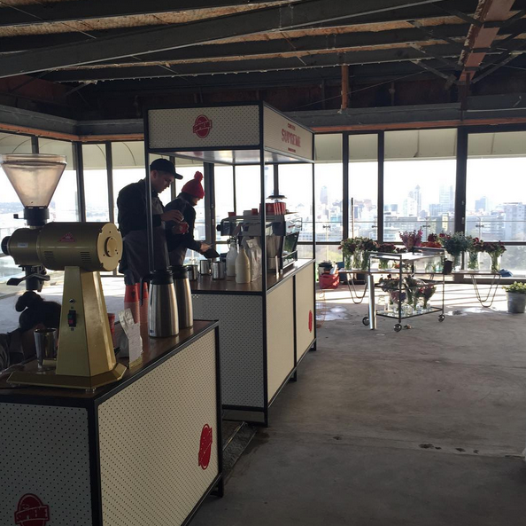
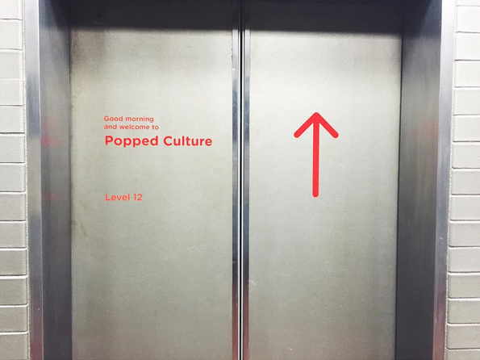
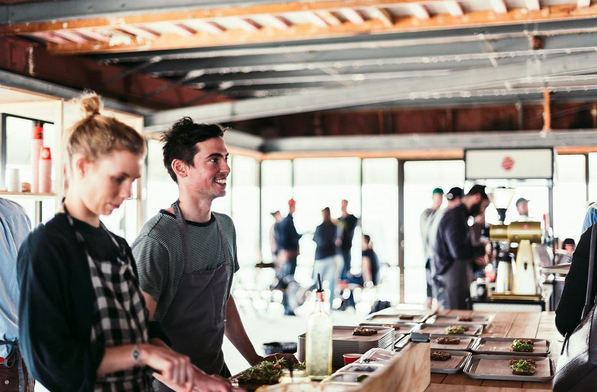

## Popped Culture (from. Coffee supreme)

뉴질랜드의 스페셜티 커피브랜드인 **커피슈프림**에서 15년 9월에 처음 연 이벤트인 **Popped Culture**.

Popped Culture는 셰프, 베이커, 독특한 로케이션, 아름다운 가구와 커피를 한자리에 모아낸다. 이른 아침 커피와 토스트를 중심으로 '언제 커피 한 잔 하자'는 인사말을 현실로 끌어낸다. 매번 그 구성이 변경되며 그에 따라 다른 모습이 연출된다.

이 이벤트를 처음 봤던 15년 가을. 커피, 게더링, 커뮤니티, 브랜드 같은 키워드를 관통하는 무언가를 느꼈던 것 같다. ''아 나도 이런걸 하고싶다!'라는 마음을 불러일으켰던 이벤트. 몇년 지난 지금봐도 전혀 어색하거나 촌스럽지 않고 회차를 거듭하며 더 잘 다듬어진 느낌이다. 브랜드가 건네는 이야기는 이렇게 본 비즈니스와는 동떨어져 보일 수도 있는 활동들을 잘 버무려내고 꾸준히 들려주어야 사람들에게 가닿을 수 있고 브랜드 확장성도 가져갈 수 있는 것 같다. 커피 콘텐츠, 브랜드 마케팅을 주로 다루며 회사에서 더 큰 행사를 진행하기도 했는데 격세지감을 느끼며(...) 다시 그 마음을 꺼내보고 싶어서 스크랩 해본다.

****

 **<u>Coffee Supreme(커피) X Tom Hishon of Orphan’s Kitchen(토핑) X Carter Were of Were Bros(빵)</u>** 

세 브랜드의 콜라보로, 각자 브랜드가 커피/빵/요리를 하나씩 도맡아 하나의 트레이를 완성해낸다.

Coffee Supreme은 조금 다른 하루의 시작을 만들 수 있도록, 토스트와 커피를 통한 '모닝 리추얼'을 주제로 한 브런치 이벤트 시리즈를 열었다. 본인들의 슬로건인 'We eat coffee for breakfast'와도 잘 어울리는 장면이다.

***Coffee Supreme is hosting a series of breakfast events focused around the morning ritual of toast and coffee.***

- 인당 16불, 티켓사이트(https://www.iticket.co.nz/events/2015/sep/popped-culture)에서 티켓을 판매. (현장판매여부는 모르겠음). 오클랜드의 한 아파트 단지 내에서 열렸다.(Shky Apartments, 44 Khyber Pass Rd, Eden Terrace.)
- SNS(www.instagram.com/supremepoppedculture/)에 준비과정을 계속 공유했다. 여기저기서 모은 과정 사진들을 글로 엮어냈다.게다가 3일짜리 이벤트에 붙인 훌륭한 네이밍과 BI, 이벤트의 홈페이지까지 별도 개설(지금은 사라졌음)했다. 기획단계부터 2,3회를 염두했을 것 같다.
- 공식 미디어 스폰서도 있다. 로컬 매거진인 VIVA(https://www.viva.co.nz/article/food-drink/eating-out/why-you-should-come-to-popped-culture/).
- 목/금/토 아침 일찍 모여서 브런치를 한다. 'We eat coffee for breakfast'.
  - 목/금: 7:30am - 9:30am, 토: 한시간 늦게 8:30am - 10:30am까지 3일간

****

완공 전단계인 아파트의 고층을 빌렸다. 오클랜드의 스카이라인이 그대로 보인다.

****

트레이 페이퍼도 제작. 디자인물 제작과정을 꾸준히 SNS로 중계한다.

****

동이 트는 행사장. 아침을 여는 행사 취지가 그대로 사진 한장에 따악- 담겼다.

****

아침 볕이 예쁘게 든다.

****

아직 완공되기 전이라 차가운 실내지만 커피와 빵, 사람들로 온기를 채워나간다.

****

이른 아침, 7시부터 많은 사람들이 입장하는 중.

****

커피슈프림의 모듈 바. 외부행사에 자주 등장해서 덕후인 나에게는 친숙한 모습^.^

****

****

트레이에 칸을 구획 해 준비된 메뉴들을 서브한다. 커피와 토스트.

****

****

popped culture 1회, 2회 각각의 사인. 1층 엘레베이터에 표시해 둔 사인도 예쁘고 조명 큐브도 좋고.

****

사람들은 즐겁다.

****

토스트가 올려진 트레이를 받아들고 옆으로 이동해 커피를 마저 받아 트레이를 꽉 채운다.

호스피털리티 씬에 새로 등장한 선수들을 축하하며 무대를 선사하는 것. Popped Culture는 단순한 부분의 합보다 더 큰 제품을 만드는 친구들 간의 협업이다.  추구하는 가치를 꾸준히 이야기하는 것의 힘을 느낀다.

(사진출처:https://sprudge.com/popped-culture-coffee-supreme-90191.html)
