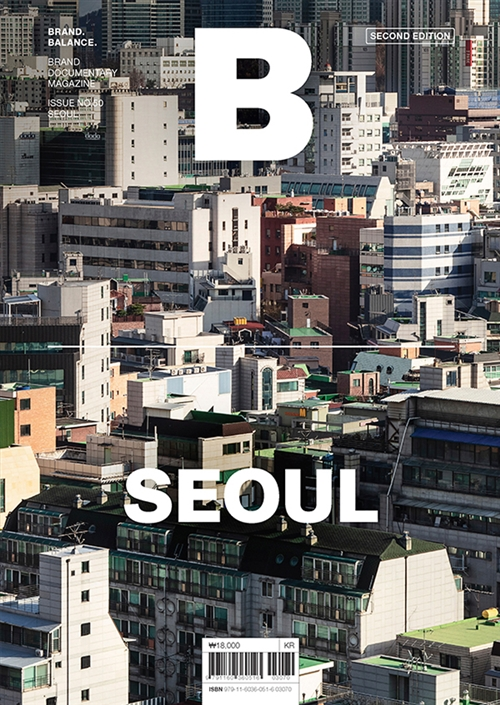
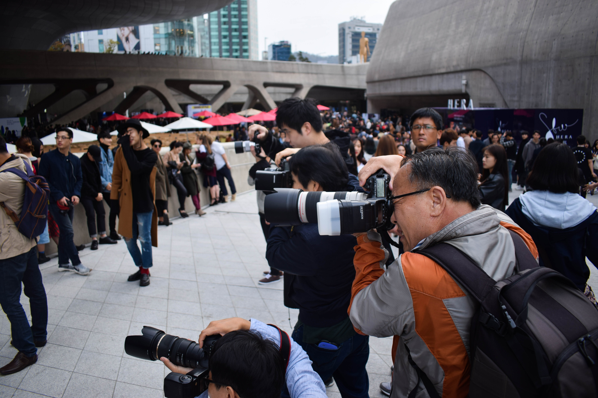
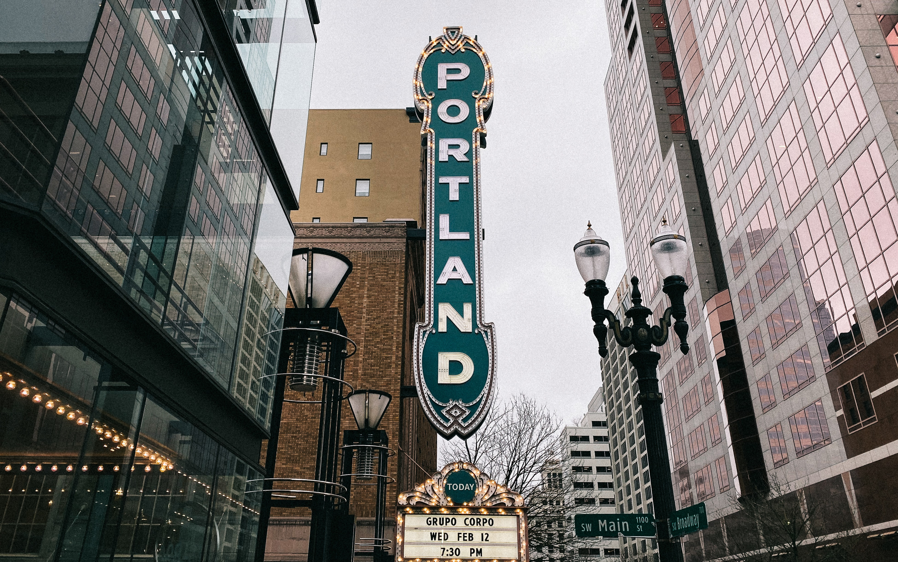

## 매거진[B] Seoul. 2nd Edition

50번째 기념, 개정판으로 낸 씨티 시리즈의 서울편 두번째.  편집장과 에디터의 토크에서 들었던 비하인드 스토리를 정리하며 2020년의 서울, 라이프스타일 씬에 대해 생각해 본다.

서울은 인구 1천만 명의 메가시티이자 대한민국의 수도로, 전쟁 이후 비교적 짧은 시간 안에 근대화와 산업화를 이룬 도시입니다. 반도체와 자동차 산업이 만든 경제적 토대를 바탕으로 21세기 새로운 성장동력이 된 IT와 엔터테인먼트 산업은 창조적인 사람을 모으고 키워내며 기민함과 역동성이라는 서울만의 에너지를 만들어왔습니다. 이에 서울의 크리에이티브가 집약된 6개 라이프스타일 신을 통해 전 세계가 주목하는 도시로 떠오른 서울의 현재와 가능성을 바라봅니다.

- Scene 1. Fashion
- Scene 2. Lifestyle & Design
- Scene 3. Stay
- Scene 4. Music
- Scene 5. Dining
- Scene 6. Coffee, Tea & Dessert

**<u>지금 서울의 배경</u>**

Fan에서 Creater로 변모하는 흐름이다.
과거 해외 문화에 대한 부러움, 동경으로부터 탐구하고 베끼고 하는 Follower의 태도와 마음이 계속되다보니 성숙하고 내재화 되다가 분출되는 시기가 지금이 아닌가 싶다. 예를들어, 지금 Hot한 90년대 장르도 그 당시 가장 앞서고 싶었던 사람들이 택한 장르인 패션이 아닌가. 그 당시 패션유학을 갔던, 한섬이나 백화점 바이어로 활동하고 있는 사람들이 지금의 유행을 만들어내고 있는 시기인 것 아닐까. 해외에서 흡수 한 것을 본인 것으로 폭발시키는 시기.

**<u>MUSIC 음악</u>**

호텔씬이 아직 컨셉에만 치중하는 편이라면, 음악씬은 로컬리티가 가장 높은 씬 같다.
'내가 하고싶어서, 내가 놀고싶어서'가 가장 많이 보여지지 않았나 싶다. (신도시 같은 곳)
음악을 소비하는 방식. 이런 문화가 성장할 수 있던 토양은 힙합이라는 생각.

6-70년대의 ROCK, 90년대의 NBA농구, 힙합, 흑인음악, 레코드바 등.  (다듀같은 팀)
그 시절 이국문화보고 성장한 KIDS(힙합KIDS)와 쇼미더머니.

락ROCK은 비관적인 정서인 반면에(그래서 생존하지 못한게아닐까ㅎㅎ)
힙합은 희망을 이야기한다는 점이 두 장르의 다른 점인 것 같다.

**<u>DINING 다이닝</u>**

미쉐린 등장 이후 대중의 소비방식이 달라졌나? 대중보다 쉐프, 업장을 기획하는 사람들에게 동기부여하는 역할,자극이 되지 않았나 싶다. 맛/음악/시각 등 총체적인 것의 합을 보여주려 하지 않나.

예를들어 '효도치킨'같은 파인다이닝+서민음식 간의 교차점을 찾는 것은 건강한 시도가 아닐까?
건강한 담론, 서울다운 시도, 업그레이드의 가능성을 보여주는 것. 다이닝씬에서 서울다운 것.서울다운 시도라는 건 하이브리드적인-혼재된 것이 아닐까한다. 브랜딩이란, 결국 내가 나를 잘 알고 나를 잘 프리젠테이팅 하는 것이니까.

**<u>COFFEE 커피</u>**

<u></u>

2년 전에도 이미 성숙했던 씬이고, 현재는 세분화되어가는 중인 것 같다.
어딜가도 반경 안에서 좋은 커피, 카페를 찾을 수 있게 되었다.

서울의 커피씬은 양적으로 질적으로 동시에 성장했다. 시간을 쪼개쓰는 문화, 바쁜중에 오아시스를 찾는 노마드적인 습성. 밥먹고 카페가고 전시보고 카페가는 일상. 엉덩이가 가벼운 사람들에게 가장 잘맞는 상공간이다.
나 오늘 이만큼 뭐 했다를 보여주기 가장 좋은 카페사진들. 동선=취향을 가장 손쉽게 보여줄 수 있는 것 아닐까?

**타르틴, 블루보틀같은 빅브랜드의 진출에 대해.** 지금 형성된 서울의 커피씬에 블루보틀의 등장은 영향이 없을 것 같다.
마블영화 챙겨보듯 브랜드소비로만 가지 커피문화에는 영향을 미치진 못하지 않을까?
로컬브랜드 영향이 더 클것. 더 확장해 나갈 수 있는 가능성, 작게 가고있는 유연함은 그들이 따라가기 어려울 것 같다.
도쿄, 뉴욕 등에 있는 잘 차려놓은 편집샵에 로컬들보다 오히려 중국 관광객들이 더 많은 것 처럼. 이벤트적 소비로 예상해본다.

**<u>FASHION 패션</u>**

패션이라는 비지니스 장르.엘리티즘의 붕괴,탈피. 인스타그램 중심의 SNS문화(이는 일본의 도제문화와 상반된다)가 패션씬에 영향을 미치면서 서울이라는 변방도시에 힘을 실어준 것 같다. 즉각 피드백을 수용하고 대응하는 IT강국의 면모가 잘 맞아떨어지지 않았나 싶다.
젠틀몬스터나 아더에러같은 브랜드가 떠오른다.

**<u>Lifestyle Boundary의 정의?</u>**

서점/가구/공간/소품/커피 등을 편집,큐레이션 하는 능력. 조화를 보여줄 수 있는 능력이라 생각한다. 어떤 필터링을 거쳐 - 어떤 방식으로 조합해 - 어떤 관점으로 보여줄 수 있는지.

라이프스타일 이라고 하면 Living Lifestyle이 가장 흔히 떠오르고 쓰이는데, 단편적 분류가 우려되어 피하고자 했다. 매거진에 다룬 모든 6개 씬들이 '라이프스타일화' 되어가는 시점이다.

**<u>라이프스타일 수준, 고민의 단계가 달라지는 척도는? 첫번째 취재했을 때와 다르거나 진화한 점이 있었는지?</u>**

라이프스타일이 발전할 수 있는 척도. (편파적 생각일 수 있지만)그 척도는 잡지가 아닐까. 혹은 미디어,목소리,의견을 내는 것.
매거진을 본다는 것은 자기만의 관점을 갖고싶다로 해석될 수 있을 것 같다.
종이책이 아니더라도 인스타그램으로부터의 다른,자기만의 voice를 가지는것도 비슷한 것 같다. 독립잡지가 잘 구비된 도시는 볼 것 도많고 성장하고 있는 도시가 아닐까 싶다.

예를들어 포틀랜드. 크게 대단한 것 없어보일 수 있지만 'Human Level', 말하자면 ''내가 당장 여기 살아도 턱이 없겠다'' 라는 생각이 드는 도시. 아웃사이더를 구분짓는 경계도 없고, 나와 별거 달라보이지 않는 삶이 비지니스로 잘 구현되어 있는 곳이다.

반면 교토는 미학적 아름다움, 어떻게 더 정제해서 보여줄까를 고민하는 곳이고.

고민하는 일상의 영역이 완전히 다른 두 도시이다.

**<u>서울 편에 등장하는 190개의 브랜드를 선택할 때 경중이 있었나?</u>**

**첫번째 에디션**에서는, 산업적으로 토양을 일군 -씬을 일으킨- 브랜드(업장)여야한다고 생각하고 다뤘다. Builders, Developers => 천편일률이라 생각될 수 있었다.

**두번째 개정판**에서는 그냥 핫한, 지금의 OO를 다루었다. 이래도 되나?하면서 이를 경계하다가 현재의 모습을 놓치는게 아닌가 싶었다. 빌더스에 힘입어 새로운 흐름, New wave을 만들고 있는 업장들이다. 패션이 가장 왕성하게 변하는 시기였다고 회고한다.

**<u>브랜딩 차원에서 보는 호텔 F&B는 어떠한지?</u>**

신라호텔 / 조선호텔 vs 레스케이프 호텔 / 라이즈 호텔
붙박이 가구 vs 이동성 가구
한번 확보한 안정성 vs 언제바뀌어도 무방한 것.(트렌드와 도시변화에 따라서)

. . .

모든 브랜드의 이야기는 자연스러운 이야기로부터 이루어져야 한다.  - <모노클> 편집장 타일러 브륄레
