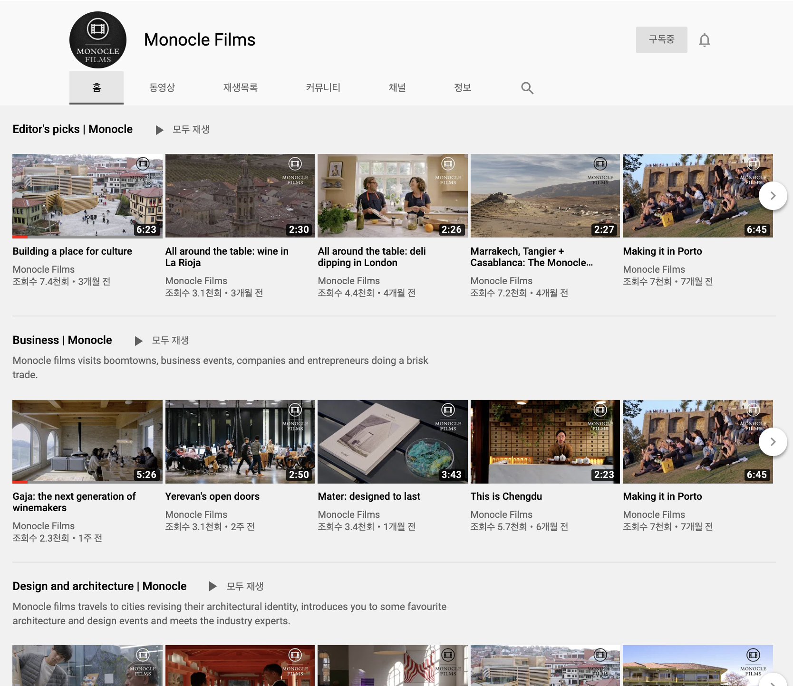
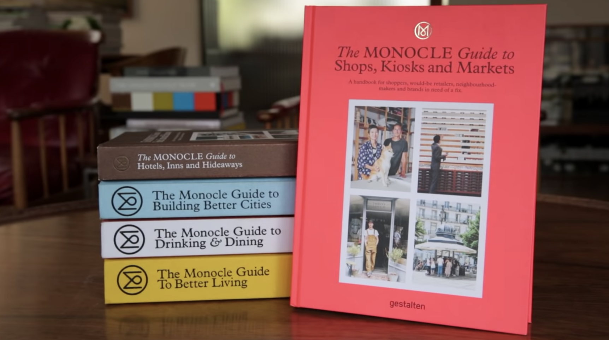
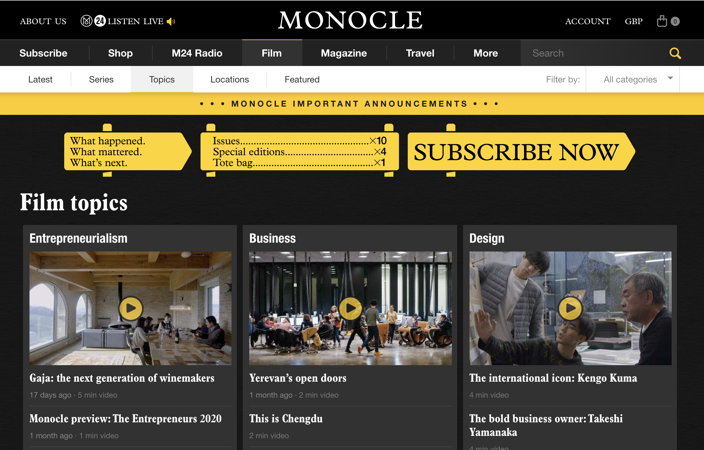
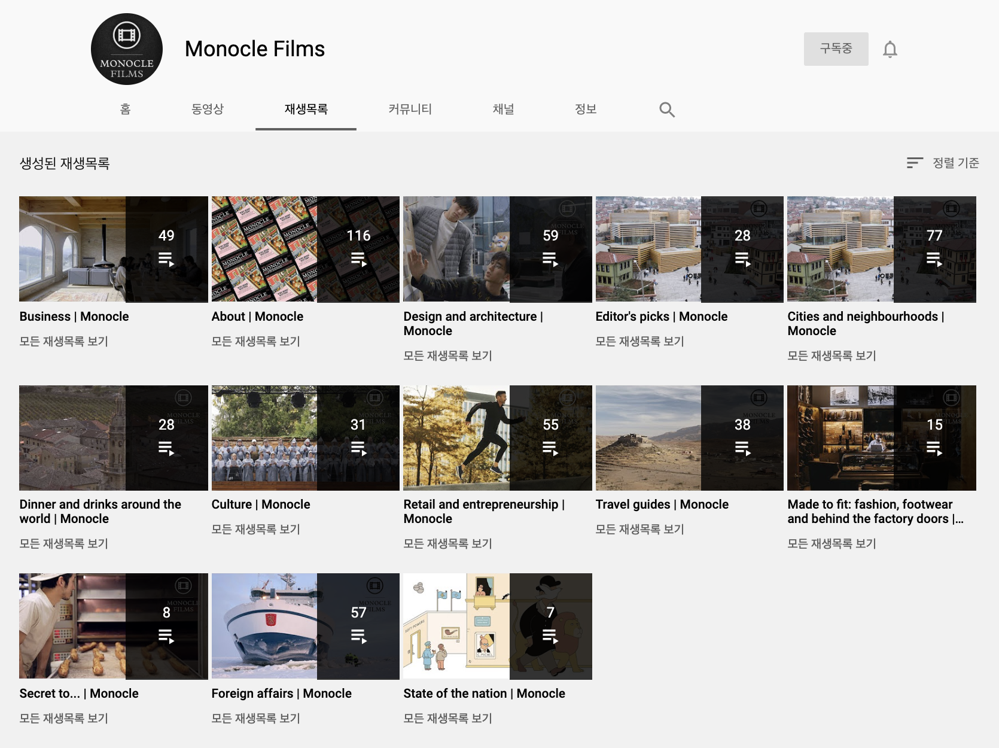

## 전통매체인 '매거진'이 유튜브를 운영하는 방법

전에, 정확히는 작년 초쯤 이런 메모를 남긴적이 있었다.

> 언제 한 번 모노클이 전개하는 채널별, 컨텐츠별로 세부를 뜯어보고 싶다.  온라인/오프라인 경계없이 콘텐츠 사업을 전개하는 회사의 구조와 일하는 방식을 가까이서 구경해보고싶다.

작은 매거진을 만들고, 그 매거진 자체를 콘텐츠 삼아 영상으로 만드는 실무를 하다가 문득, '다들 오프라인 매거진을 온라인에서는 어떻게 Feature 할까'가 궁금해져서 떠오르는대로 유튜브에서 **모노클monocle**을 검색했다.

 

 

[유튜브 바로가기](https://www.youtube.com/user/monoclemagazine/featured)

### 유튜브 메인 살펴보기

메인홈에 노출된 6개의 카테고리는 모노클 본지 또는 단행본에서 다루는 토픽 위주로 노출되어 있다. 책과 유튭 카테고리명이 완전히 일치하지는 않지만 단행본/매거진의 내용을 어떻게 온라인으로 연결짓고 확장시킬 것인가에 대한 힌트가 될 수 있다. 모노클은 '잡지가 먼저'라는 확실한 선후관계가 있기에 사례로서 좋은 것 같다. (실제 모노클의 단행본들을 보면 온라인에서 구분된 카테고리들에 끄덕이게 된다.)

 

1. **Editor's Picks** 에디터 픽
2. **Business** 비즈니스
3. **Design and architecture** 디자인과 건축
4. **Travel Guide** 트래블 가이드
5. **Retail and entrepreneurship** 리테일과 기업가정신
6. **About** 다가오는 이벤트나, 책 발간, 프로모션 등 모노클 소식

 [모노클 홈페이지](https://monocle.com/film/topics/ "monocle homepage link") 내에도 영상만 다루는 페이지인 'film' 메뉴가 있다. 그 아래 Latest / Series / Topics / Locations / Featured로 유튜브와는 다르게 하위분류가 되어있는데, 역시 영상 전용 플랫폼인 유튜브보단 접근성 낮아보이는 UX이다.

### 재생목록 살펴보기

(메인홈에 편집된 6개의 카테고리도 포함된) 전체 재생목록 13개를 보니까, 내가 처음 이 페이지에 오게된 이유-종이 매거진 읽기의 동영상화-와는 다른 방향으로 생각을 이끌어준다. 모노클 매거진 자체가 가진 헤리티지와 편집방향이 단단하기 때문에 이렇게 온라인 채널이 추가되고 확장되는 것에 큰 이슈는 없어보인다. 사실 실무에서는 취재 시 사진찍고 기사만 쓰는게 아니라 영상에 대한 수고(기획/촬영/에디팅)가 더 들어가기 때문에  콘텐츠 만드는 방식은 좀 달라졌을 수 있겠지. 이 변화에는 어떻게 대처했는지 내부 속사정도 궁금해진다. 

 

### 재밌는 콘텐츠들 몇개 살펴보기.

(..tbd)

영상은 대부분 취재기사나 애드버토리얼 콘텐츠들의 영상 미리보기 또는 요약 위주다. 인터뷰가 영상으로 담겨지니 좀 더 생동감있고 흡입력이 좋다. 인터뷰 전문을 보고 싶다면 잡지를 사야함. 그런데 유튜브에 올라온 모든 영상에 댓글사용이 중지되어있다. 왜일까?

### 마무리.

나처럼 모노클의 직접적 타겟도 아니고, 매거진을 매 달 구독하지 않는 이들에게는 이렇게 영상으로나마 그 무드나 메세지를 미리보기(엿보기) 할 수 있게 해주는 역할로 손색없다. 몇 개의 영상을 본 뒤에, '이번 이슈는 구매 해보고 싶다' 라는 감상까지 남는다면 금상첨화겠고.

발행된 매거진 책의 모습이나 넘겨보는 장면 등 을 그대로 찍어 온라인에 올리는 것 정도로 생각했던 1차적 아이데이션이 너무 무색해질 정도로, 얕은 내 생각과는 접근 레벨이 달랐다. 종이 그 너머로 수집된, 취재된 콘텐츠의 '진짜배기' 향이 베어있는 비디오들이 가득하다.

내가 유튜브를 운영한다면 어떻게 할까? 우리 브랜드가 가진 시각으로 보는 특정장르나 특정대상을 보여주는 채널로 이용하면 좋을 것 같다는 생각이 일단은 들고.  예를 들면 "커피는 내가 내릴게 음악은 누가틀래?"로 음악에 대한 이야기를 스토어에서, 매거진에서 다루고 유튜브에서는 그 음악을 들을 수 있게 한다거나, "직업 바리스타 사장님으로 카페를 운영하면서 환경에 도움되는 방법"으로 스토어에서의 실행과 더불어 그 배경 과정이나 인터뷰를 유튜브로 소개한다거나... 무작정 영상 컨텐츠를 만들어낸다의 접근 보다는, 커피를 식음료-호스피탈리티-라이프 같이 Broad하게 다양한 이야기를 다루면서도 주인공인 '커피'와 자연스럽게 연결될 수 있는 매개로 삼으면 좋겠다. 핵심에서 벗어나 너무 멀리가지 않으면서도~~ 메세지도 잘 전하는 콘텐츠들이면 좋겠는데. (그래서 뭐..)

아직은 고민 수준이 얕지만, 온라인/오프라인 경계없이 브랜드의 생각을 콘텐츠로 잘 만들어 전개하는 팀의 일하는 구조와 방식을 꾸준히 보면서 배워가고 싶다.