**DNVD** Digitally-Native Vertical Brand (a.k.a V commerce) 사례 디깅하기.

  

  [Instagram](https://www.instagram.com/kencko/, "kencko instagram link") [website](https://www.kencko.com/, "kencko website link")

**We’re obsessed with the idea of simplifying the consumption of organic fruits and vegetables.**

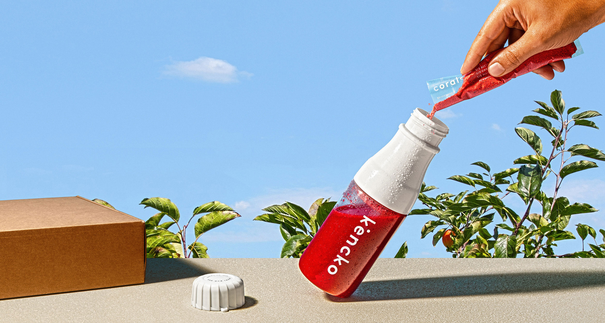

위 사진 한 장으로 서비스 설명이 된다. 켄코는 과일, 채소를 파우더 형태로 1회분 팩에 담아 구독서비스로 제공한다. 물을 타서 흔들어주면 금새 스무디 한 잔이 완성! Soylent 같은 식사 대체품이 아니라 영양 성분을 그대로 유지하는 전체 과일과 채소에 대한 대안이다.

이 사진 한장만 보아도 얼마나 밀레니얼하고 컬러풀 아이코닉하게 잘 닦인 디지털 네이티브 버티컬 브랜드인가. 한번 알아보자.

DTC(direct-to-consumer)로 하는 구독 베이스의 서비스다. 100% 유기농 과일/채소로 만든 패킷을 보틀과 함께 배송한다. 보시다시피 일단 예뻐. 과일,채소 원료라 제품색이 비비드해. 박스 윗면엔 역시 개인화된 메세지 차원에서 고객 이름을 적어준다.

과일러버이자 생과일주스,스무디 종류를 좋아하는 나로서는 궁금할 수 밖에 없는 브랜드!  선 스터디 - 후 구매. 이 기회에 직구해서 먹어볼거야.

## 1. 브랜드 탄생기

2018년생 브랜드 켄코. 미국보다 평균수명이 길다는 일본에서 '건강'을 뜻하는 말인 **켄코Kencko** 를 브랜드명으로 삼았다.  *가끔 보면 이런식으로 일본문화에서 영감을 받아 브랜드를 전개하는 브랜드들이 있는데, 뉴질랜드 브랜드인 커피 슈프림의 첫 해외권 진출도 일본으로(같은 오세아니아인 호주 제외) ''사랑도 통역이 되나요' '로부터 도쿄에 대한 로망을 가졌다는 스토리가 있다. 한국도 더 자주 그런 대상이 되었으면 하는 생각이 든다. 

아무튼 아래 사진의 Tomas Froes와 Ricardo Vice Santos 둘이 코파운더이다.  토마스와 리카르도 둘 다 포르투갈의 포르투 출신. 서비스 자체는 뉴욕 베이스로 전개중이다.

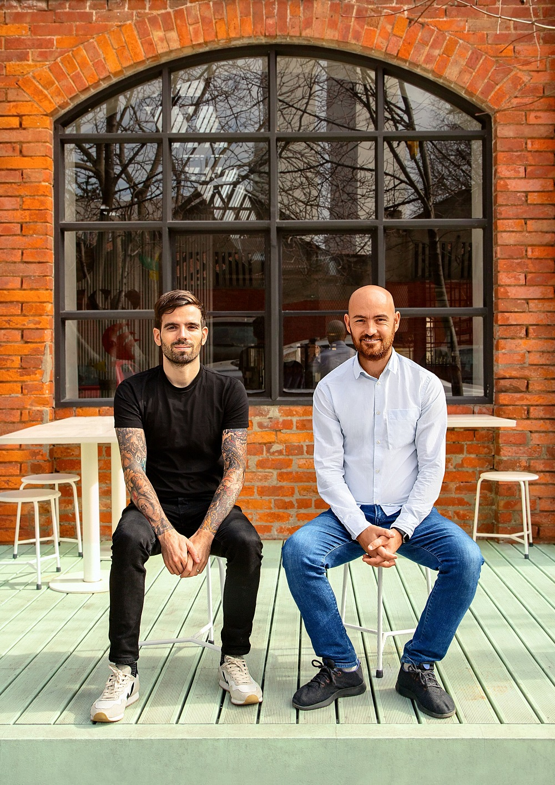

Tomas Froes가 급성 위염을 진단받았을 때 제안 된 치료법은 평생 동안 약을 복용하는 것이었다고 한다. 그는 그 전에 먼저 식습관을 바꿔보기로 했고 90%plant-based diet(식물성 식이요법? 베지테리안과는 다른것인지 궁금)로 스스로를 치료했다고 한다.이 사건이 켄코의 설립 배경이다. 그 후 둘은 신선한 과일과 야채를 편하게 효율적으로 하루 권장량을 섭취할 수 있는 스무디 믹스를 개발하게 된다.

지난 해 7월, 340만달러의 Seed라운드 투자를 받았다. DTC전략을 강화하고  사람들의 과일과 야채 소비를 추적하는 데 도움이되는 모바일 앱을 개발 예정이라고 한다. 이제 더 성장할 일만 남았다!

## 2. 제품 

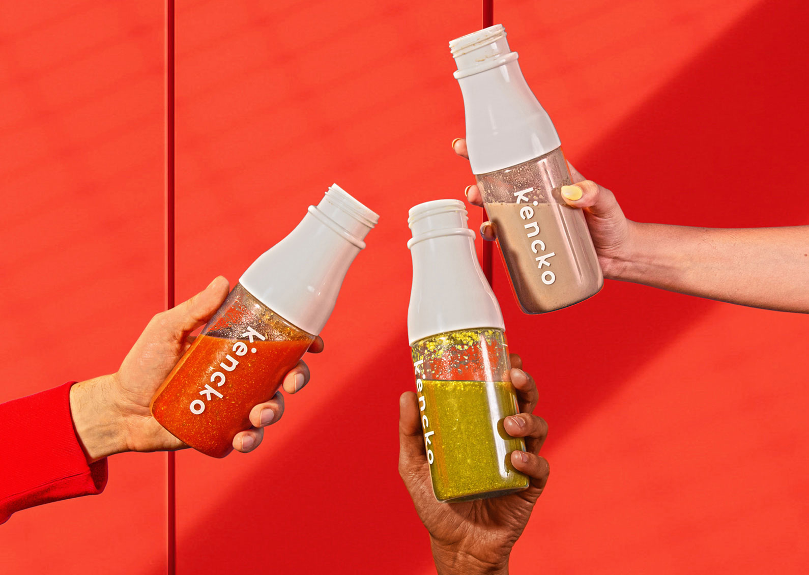

패킷 당 $2~5 정도 가격이다. 작은 파우더 하나가 오천원 이상이라고 생각하면 저렴하진 않은 편.  뭐 콜드프레스 주스나 스무디와 비교하면 저렴하겠지만, 실제 생과일 주스와 비교 가능한 수준인지는 내가 고객으로 직접 먹어봐야 알 수 있을것 같다. 하지만 냉장고나 냉동고에 식재료를 보관하는 것 보다는 켄코 제품의 수명이 더 길기 때문에 (6개월) 음식물 쓰레기를 줄이는 데 도움이 된다는 메리트를 브랜드에서는 내세운다. 

#### 2-1. 구독 옵션

구독 시 선택 가능한 구성은 크게 **몇 팩 받을지**를 기준으로 세가지 선택지가 있다.  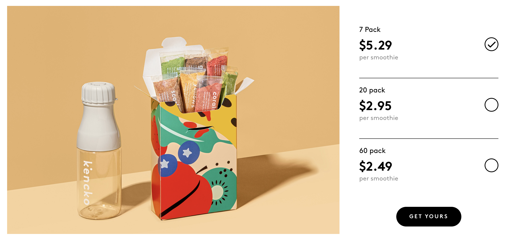[7팩/20팩/60팩] 중 선택 가능. 한팩 당 얼마인지 표기되어 있다. 많이 주문할수록 싸다.

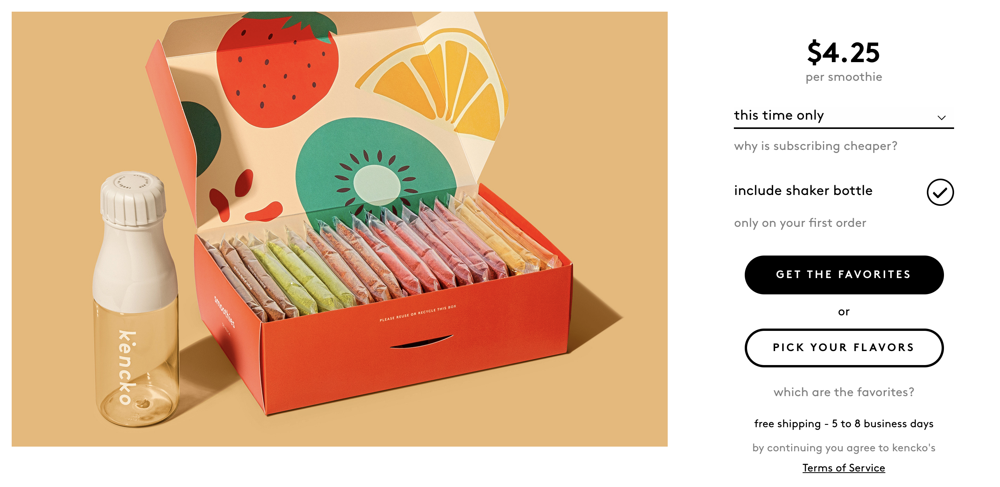20팩 짜리를 선택해 보았다. 팩 수에 따라서도 그렇지만 주기에 따라서도 1팩당 가격은 조금씩 달라진다. 역시 자주, 많이 주문할수록 싸진다.

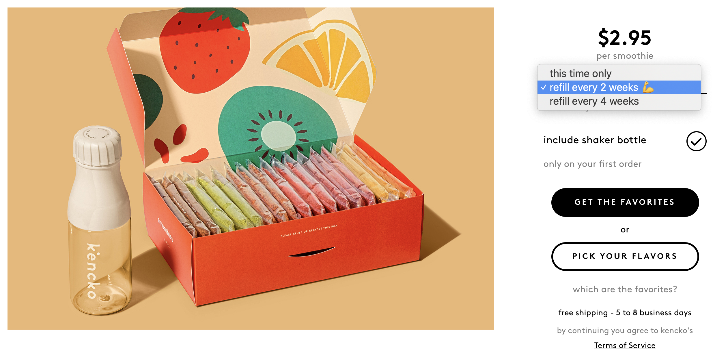[이번 한번만 / 2주마다 리필 / 4주마다 리필] 중 주기 선택이 가능하다. 

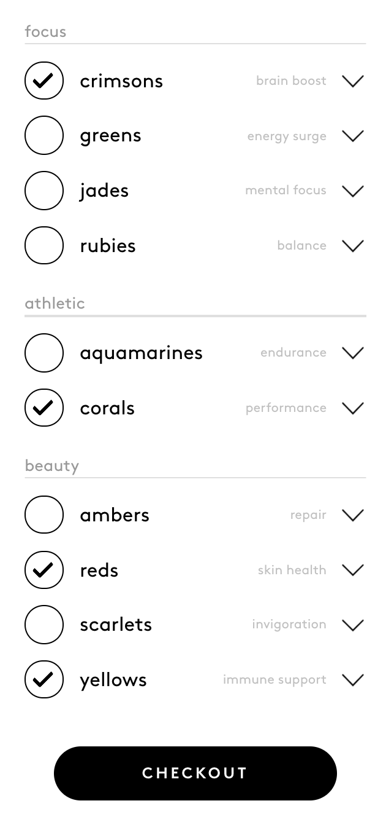

맛 선택은 원하는대로 골라 담거나, 기본 추천된 대로 구매하거나.

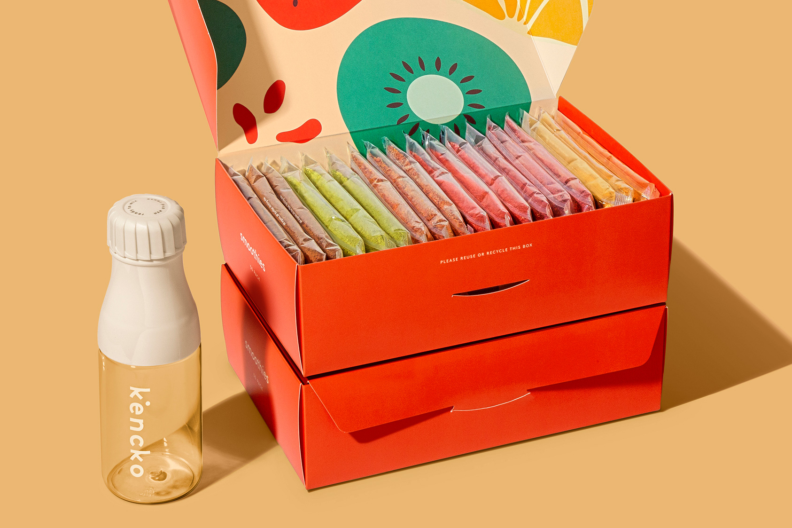

60팩은 이렇게 생겼다.

#### 2-2. 패킷(파우더) 종류

현재 총 12가지 구성, 다양한 조합으로 70칼로리부터 90칼로리 선이다. 개인적으로는 1번 crimsons, 6번 corals, 12번 yellows가 먹고싶다. 근데 7번 Jades에 쥬키니 들어있는데 저거 뭐야 궁금해..

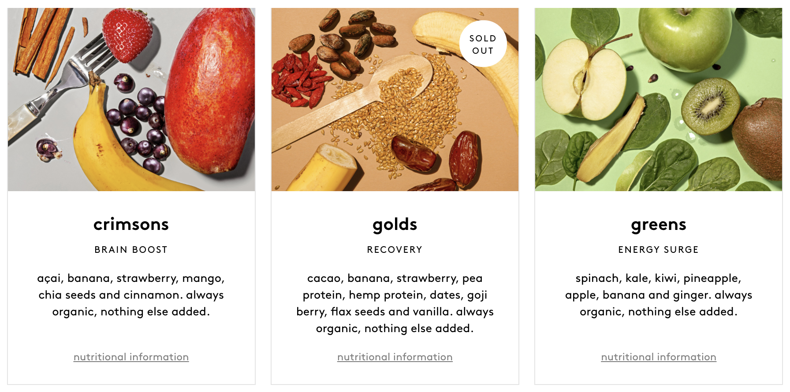

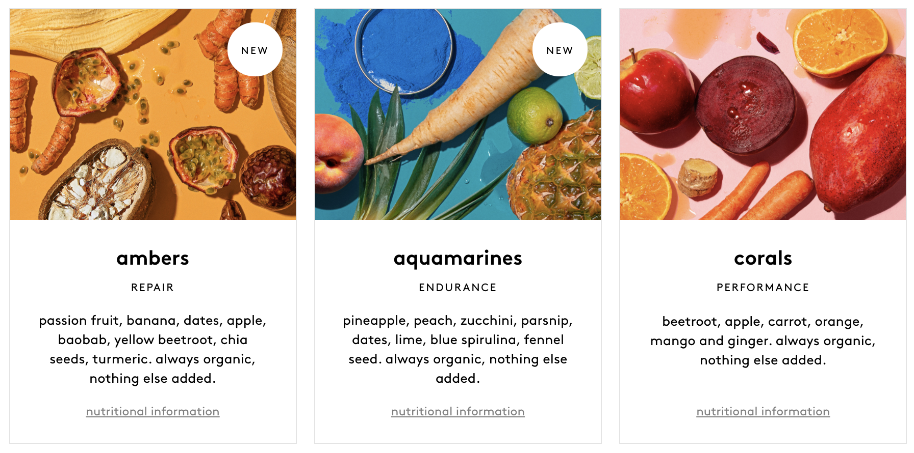

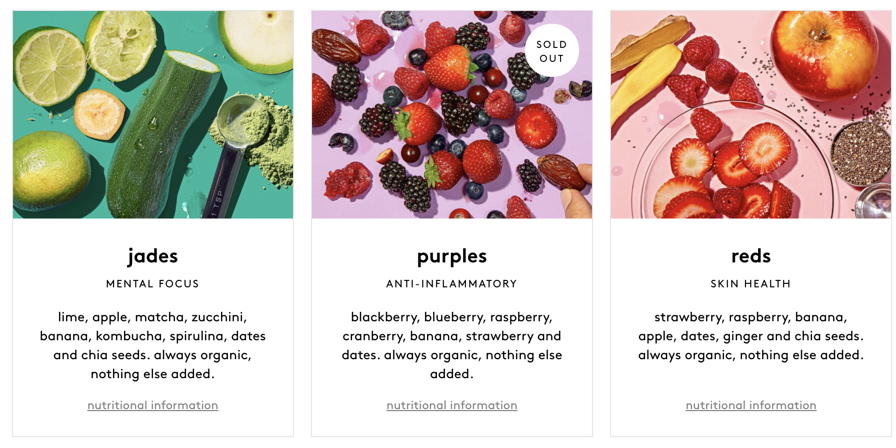

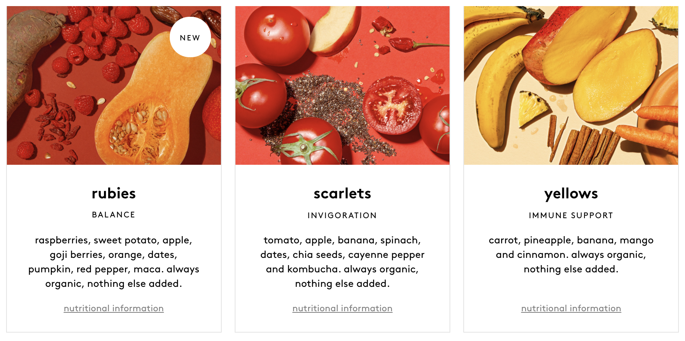

## 3. 생산 공정

웹사이트 내 Our story 영상을 캡쳐했다. 브랜드 전개는 주로 뉴욕에서 하지만, 공장 시설은 포르투갈의 리스본에 위치하고 있다.멋져!

농장에서 딸기를 수확한다.

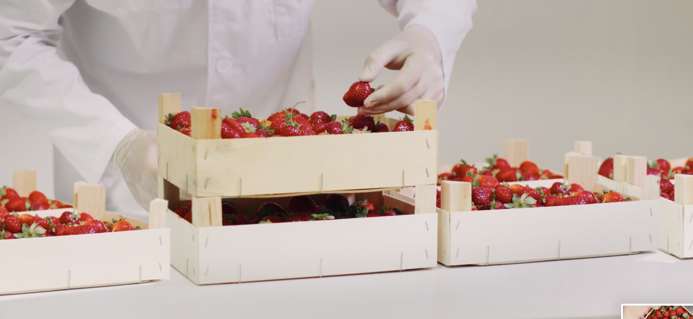

공장으로 그대로 이동된 딸기들

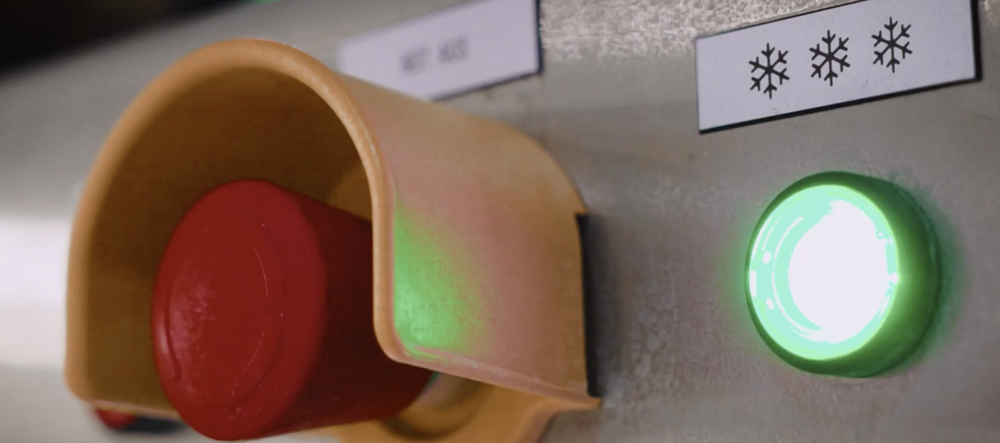

컬러와 향, 영양분이 비교적 손상되지 않는 동결건조과정을 거친다.

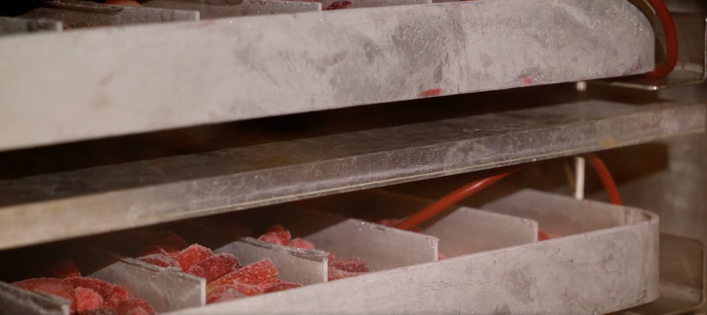

 먼저 급속냉동flash-frozen 기술로 얼린다.

급속 냉각 후 냉동 딸기가 되었다.

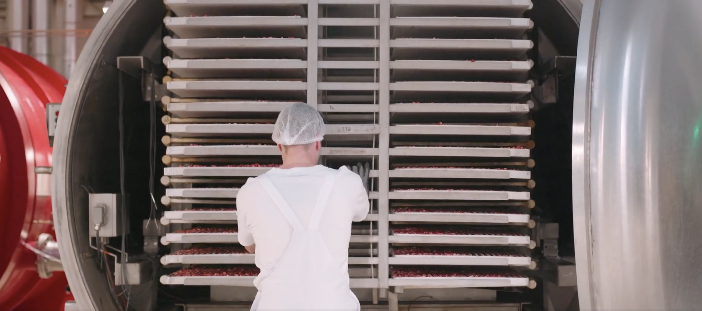

냉동 뒤 건조과정을 거친다. 가열 공정을 사용하여 농산물을 분말로 만들기 전에 농산물에서 수분을 빼낸다.

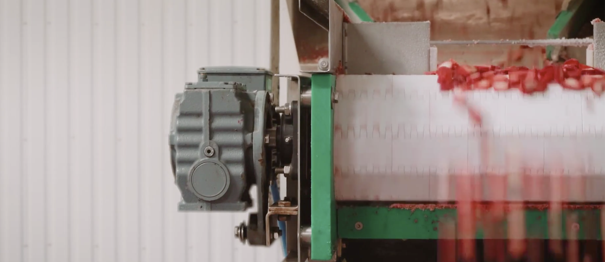

딸기말랭이가 되었다. 설탕 등의 첨가제는 없고 제품은 최대 6개월까지 지속할 수 있다고 한다.

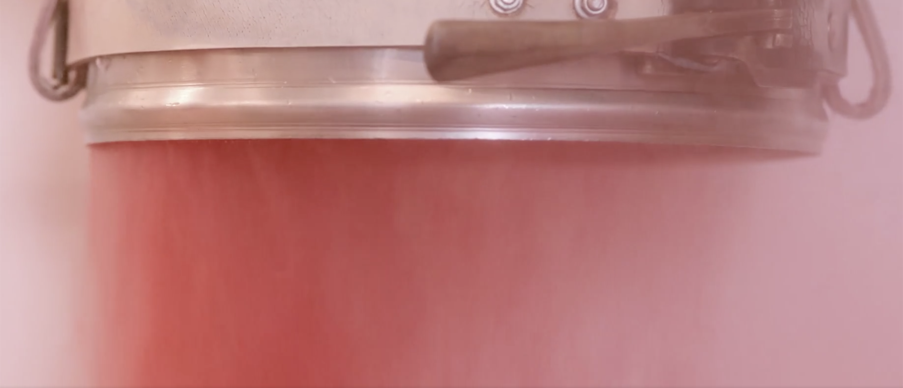

영양소 낭낭한 딸기 파우더가 되었다.

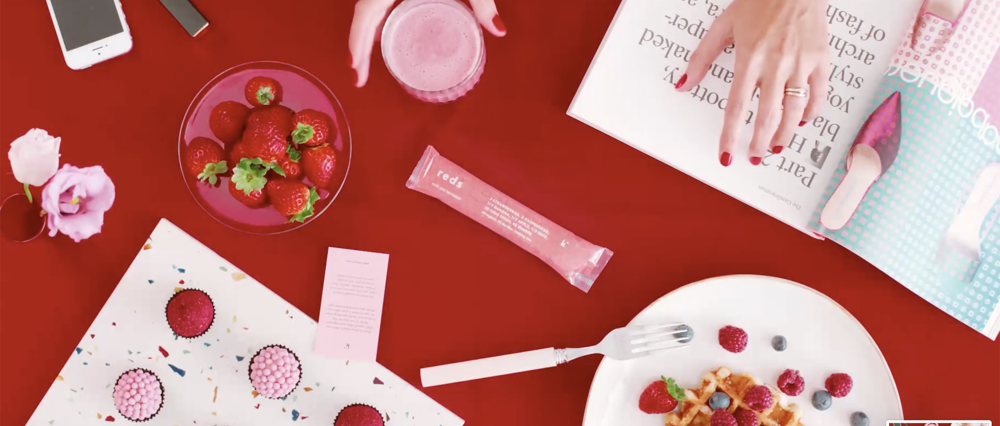

비닐은 화석 연료가 아닌 재생 가능한 식물 기반 셀룰로오스로 만들어진 투명한 플라스틱으로 만들어 사용한다.

이 다음에는  직접 마셔보고 구매후기를 남길 수 있길-!

## Kencko, Make America Healthy again!

[참고 기사] https://www.forbes.com/sites/michaelpellmanrowland/2019/09/09/kenckos-message-in-a-bottle-drink-more-and-be-healthy/#199326ad59ab

